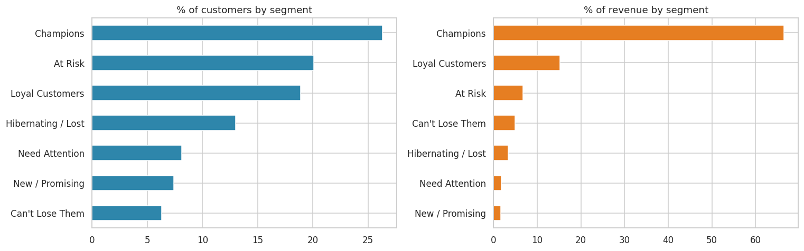
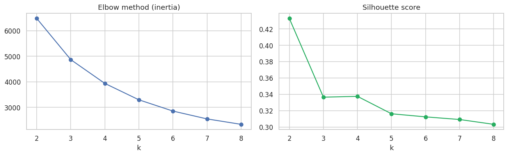
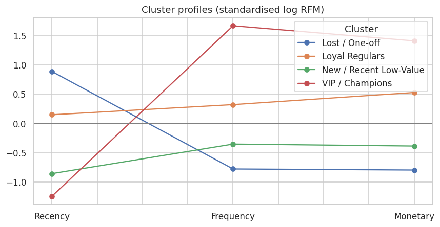
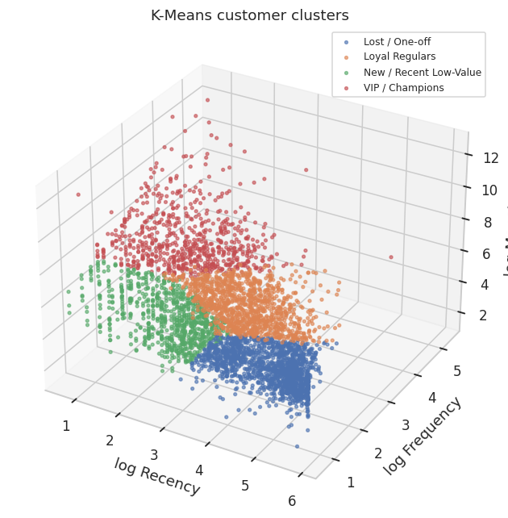

# 🛍️ Customer Segmentation: RFM Analysis + K-Means Clustering

  

**Business problem:** a UK online gift retailer markets to every customer the same way. I segmented **4,338 customers** by purchasing behaviour, **Recency, Frequency and Monetary value**, using two methods: a rule-based RFM scoring model and **K-Means clustering**. The result is clear, actionable segments for marketing.

## 📊 Dataset
[UCI Online Retail](https://archive.ics.uci.edu/dataset/352/online+retail): **541,909 transactions** (Dec 2010 – Dec 2011), invoice-level data with product, quantity, price, customer and country.

## 🛠️ Approach
1. **Cleaning** (541,909 → 392,692 rows): dropped rows with no CustomerID, cancellations (`C` invoices), non-positive quantity or price, and duplicates
2. **RFM table:** per customer, days since last purchase, number of invoices and total spend
3. **Approach A, rule-based RFM:** quintile scores (1–5), mapped to 7 named segments
4. **Approach B, K-Means:** log-transformed and standardised RFM; *k* chosen with the elbow method and silhouette score; clusters profiled and named
5. Compared both methods (crosstab) and exported `output/customer_segments.csv` for the CRM

## 🏆 Results: K-Means segments (k = 4)
| Segment | Customers | Median recency (days) | Median orders | Median spend | % of revenue |
|---|---|---|---|---|---|
| 💎 **VIP / Champions** | 713 (16%) | 8 | 10 | £3,723 | **64.9%** |
| 🟢 **Loyal Regulars** | 1,166 (27%) | 57 | 4 | £1,345 | 23.6% |
| 🆕 **New / Recent Low-Value** | 837 (19%) | 17 | 2 | £480 | 5.2% |
| 🔴 **Lost / One-off** | 1,622 (37%) | 175 | 1 | £296 | 6.2% |

**Headline:** **16% of customers generate 65% of revenue.** Another 37% are lost or one-off buyers who bring in only 6%.

## 📈 Visuals
| Rule-based RFM segments | Elbow & silhouette |
|---|---|
|  |  |
| **Cluster profiles (snake plot)** | **3-D clusters** |
|  |  |

## 💡 Recommendations
| Segment | Strategy |
|---|---|
| 💎 VIP / Champions | Loyalty programme and early access, no discounts needed; ask for reviews and referrals |
| 🟢 Loyal Regulars | Cross-sell and bundles to move them up to VIP; win-back nudges if they go quiet |
| 🆕 New / Recent Low-Value | Welcome series and a second-purchase incentive to build the habit |
| 🔴 Lost / One-off | Low-cost automated campaigns only; don't spend heavily on them |

The rule-based segments ("Champions", "At Risk", …) are easier to explain to marketing. K-Means finds the natural groups in the data. The two methods broadly agree.

## ▶️ How to run
```bash
pip install -r requirements.txt
jupyter notebook rfm_kmeans_segmentation.ipynb
```

## 📁 Structure
```
├── data/online_retail.csv.gz        # raw transactions (compressed)
├── images/                          # charts
├── output/customer_segments.csv     # RFM scores + segment + cluster per customer
├── rfm_kmeans_segmentation.ipynb
└── README.md
```

---
👤 **Ansh Rai**, Data Analyst · [LinkedIn](https://www.linkedin.com/in/anshrai-adr) · [GitHub](https://github.com/ANSHRAI21) · [Portfolio](https://a-s-pyratech-solutions.space)
